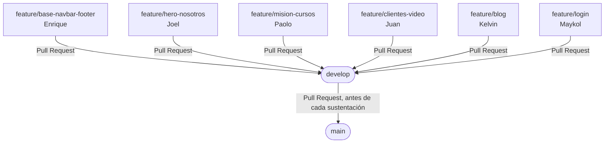

# Guía de trabajo en equipo (Gitflow)

Repositorio: https://github.com/escuela-juridica/herramientas-desarrollo-proyecto.git

Esta guía es para clonar el proyecto, crear tu rama y subir tu trabajo sin pisar el de los demás. Todo el mundo pasa por `develop`, nunca directo a `main`.

## Diagrama de ramas



Cada `feature/*` sale de `develop` y vuelve a `develop` por Pull Request. `develop` solo pasa a `main` cuando todo el equipo ya integró y probó su parte.

## 1. Clonar el repositorio

Solo la primera vez, en tu computadora:

```
git clone https://github.com/escuela-juridica/herramientas-desarrollo-proyecto.git
cd herramientas-desarrollo-proyecto
```

## 2. Cambiarte a `develop` y traer lo último

```
git checkout develop
git pull origin develop
```

`develop` es la rama de integración: ahí se juntan las partes de todos antes de pasar a `main`. Nunca se trabaja directo sobre ella.

## 3. Crear tu rama de trabajo

Tu rama sale **desde `develop`** (asegúrate de haber hecho el paso 2 justo antes). El nombre debe ser exactamente el que te toca:

| Integrante | Rama a crear | Qué construye |
|---|---|---|
| Enrique Prada | `feature/base-navbar-footer` | Navbar + footer + `base.css` — ya está hecho |
| Joel Saldaña | `feature/hero-nosotros` | Banner/carrusel de portada + sección Nosotros |
| Paolo Añorga | `feature/mision-cursos` | Misión y Visión + sección Servicios (6 cursos) |
| Juan Morales | `feature/clientes-video` | Carrusel de Clientes + Video representativo |
| Kelvin Acevedo | `feature/blog` | Sección Blog (3 artículos) |
| Maykol Calle | `feature/login` | `login.html` completo |

```
git checkout -b feature/tu-rama-aqui
```

Este comando se usa **una sola vez** (crea la rama y te cambia a ella). Los días siguientes, para volver a tu rama, solo usas:

```
git checkout feature/tu-rama-aqui
```

## 4. Trabajar en tu parte

- Abre `inicio.html` (o `login.html` si eres Maykol) y busca el bloque marcado con tu nombre — tiene borde punteado de color y dice "AQUÍ VA: [sección] — [tu nombre]".
- Elimina ese bloque de ejemplo por completo y pon tu HTML real en su lugar.
- Pega tu CSS en `css/inicio.css` (o `css/login.css`), en el bloque que dice "👉 Pega aquí...".
- Si tu sección necesita JS, revisa la carpeta `js/` (por ahora solo Paolo tiene `cursos.js`, con una función vacía).
- **No toques** el navbar, el footer, ni el bloque de otro compañero.

Todo el detalle de qué debe llevar cada sección está en el `README.md` del proyecto.

## 5. Guardar tus cambios (commit)

Cada vez que avances algo importante:

```
git add .
git commit -m "feat: [descripción corta de lo que hiciste]"
```

Ejemplos de buenos mensajes de commit:
- `feat: agregar carrusel de portada con 5 slides`
- `feat: estructura HTML de la sección Nosotros`
- `style: ajustar responsive de tarjetas de clientes`

## 6. Subir tu rama al repositorio

La primera vez que subes tu rama:

```
git push -u origin feature/tu-rama-aqui
```

Las siguientes veces, ya alcanza con:

```
git push
```

## 7. Actualizar tu rama con lo nuevo de `develop`

Antes de abrir el Pull Request (o si pasó tiempo desde que la creaste), trae los cambios que otros ya subieron a `develop`:

```
git checkout develop
git pull origin develop
git checkout feature/tu-rama-aqui
git merge develop
```

Si aparece un conflicto, Git te va a marcar los archivos afectados — resuélvelos, guarda, y luego:

```
git add .
git commit
```

## 8. Abrir el Pull Request

En GitHub, entra al repositorio y crea el Pull Request de tu rama **hacia `develop`** (no hacia `main`). Antes de pedir que lo revisen:

- Abre `inicio.html`/`login.html` en el navegador y verifica que se vea bien en escritorio y en una ventana angosta (móvil).
- Confirma que no tocaste archivos fuera de tu bloque asignado.

## Comandos importantes (resumen)

| Comando | Para qué sirve |
|---|---|
| `git status` | Ver qué archivos modificaste antes de hacer commit |
| `git checkout develop` | Cambiarte a la rama de integración |
| `git pull origin develop` | Traer lo último de `develop` — hacerlo **siempre antes de empezar a trabajar** |
| `git checkout -b feature/tu-rama` | Crear tu rama (solo la primera vez) |
| `git checkout feature/tu-rama` | Volver a tu rama en los días siguientes |
| `git add .` | Marcar tus cambios para el commit |
| `git commit -m "mensaje"` | Guardar tus cambios en tu rama local |
| `git push -u origin feature/tu-rama` | Subir tu rama al repositorio (primera vez) |
| `git push` | Subir cambios nuevos (siguientes veces) |
| `git merge develop` | Traer a tu rama lo nuevo que ya se integró en `develop` |

## Reglas que no se rompen

- Nunca `git push` directo a `main` ni a `develop` — todo entra por Pull Request.
- Nunca trabajar directamente sobre `develop` o `main` — siempre en tu `feature/*`.
- `develop` se mergea a `main` solo cuando todo el equipo terminó y probó su parte, antes de cada sustentación.
