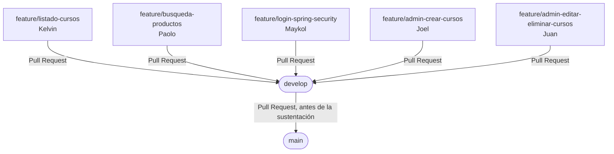

# Guía de trabajo en equipo (Gitflow) — Avance 2

Repositorio: https://github.com/escuela-juridica/herramientas-desarrollo-proyecto.git

Esta guía es para clonar el proyecto, crear tu rama y subir tu trabajo sin pisar el de los demás. Todo el mundo pasa por `develop`, nunca directo a `main`.

> Esta es la modalidad de trabajo del **Avance 2** (Spring Boot + Thymeleaf + PostgreSQL). El reparto del Avance 1 (sitio estático) quedó atrás.

## Diagrama de ramas


```mermaid
graph TD
  main(["main"])
  develop(["develop"])
  f1["feature/listado-cursos<br/>Kelvin"]
  f2["feature/busqueda-productos<br/>Paolo"]
  f3["feature/login-spring-security<br/>Maykol"]
  f4["feature/admin-crear-cursos<br/>Joel"]
  f5["feature/admin-editar-eliminar-cursos<br/>Juan"]

  f1 -->|Pull Request| develop
  f2 -->|Pull Request| develop
  f3 -->|Pull Request| develop
  f4 -->|Pull Request| develop
  f5 -->|Pull Request| develop
  develop -->|Pull Request, antes de la sustentación| main
```

Cada `feature/*` sale de `develop` y vuelve a `develop` por Pull Request. `develop` solo pasa a `main` cuando todo el equipo ya integró y probó su parte.

## 1. Clonar el repositorio

Solo la primera vez, en tu computadora:

```
git clone https://github.com/escuela-juridica/herramientas-desarrollo-proyecto.git
cd herramientas-desarrollo-proyecto
```

## 2. Cambiarte a `develop` y traer lo último

```
git checkout develop
git pull origin develop
```

`develop` es la rama de integración: ahí se juntan las partes de todos antes de pasar a `main`. Nunca se trabaja directo sobre ella.

## 3. Crear tu rama de trabajo

Tu rama sale **desde `develop`** (asegúrate de haber hecho el paso 2 justo antes). El nombre debe ser exactamente el que te toca:

| Integrante | Rama a crear | Qué construye |
|---|---|---|
| Kelvin Acevedo | `feature/listado-cursos` | Página pública de productos: listar los 20 cursos desde la base de datos, con sus imágenes |
| Paolo Añorga | `feature/busqueda-productos` | Búsqueda estática y dinámica en esa misma página (JS + `fetch` contra la base de datos) |
| Maykol Calle | `feature/login-spring-security` | Login real con Spring Security: autenticar contra `administrador`, proteger `/admin/**`, redirigir solo al panel |
| Joel Saldaña | `feature/admin-crear-cursos` | CRUD en `/admin/cursos`: listar, crear, búsqueda estática |
| Juan Morales | `feature/admin-editar-eliminar-cursos` | CRUD en `/admin/cursos`: búsqueda dinámica, editar, eliminar (borrado lógico) |

```
git checkout -b feature/tu-rama-aqui
```

Este comando se usa **una sola vez** (crea la rama y te cambia a ella). Los días siguientes, para volver a tu rama, solo usas:

```
git checkout feature/tu-rama-aqui
```

## 4. Trabajar en tu parte

A diferencia del Avance 1, acá no hay bloques marcados con tu nombre — el proyecto es Spring Boot y cada parte vive en su propio paquete/controlador. Dónde tocar según tu tarea:

**Kelvin** (`feature/listado-cursos`):
- `CatalogoController.java` (`src/main/java/pe/edu/escuela/app/controller/`) — agregar el método que trae los cursos desde `CursoService`/`CursoRepository` y los pasa al modelo.
- `templates/catalogo.html` — reemplazar el placeholder por el `th:each` que arma las tarjetas.
- `css/catalogo.css` — estilos de las tarjetas.

**Paolo** (`feature/busqueda-productos`):
- Mismo `catalogo.html`/`CatalogoController.java` que Kelvin — **coordina con él antes de tocar el archivo**, van a compartirlo.
- Un endpoint de búsqueda (puede ser en el mismo `CatalogoController` o uno nuevo) que reciba el texto y devuelva los cursos filtrados.
- JS nuevo (ej. `js/catalogo.js`) con el `fetch` que llama a ese endpoint en cada tecla para la búsqueda dinámica, y el botón para la estática.

**Maykol** (`feature/login-spring-security`):
- Agregar la dependencia `spring-boot-starter-security` al `pom.xml`.
- Una clase de configuración de seguridad (`SecurityConfig`) + un `UserDetailsService` que busque por `correo` en `administrador` (la entidad y el repositorio ya existen, falta el repositorio de `Administrador` si no existe todavía).
- `LoginController.java` y `templates/login.html` — conectar el formulario al login real de Spring Security en vez del redirect a mano que hay ahora.
- Proteger `/admin/**` para que solo un admin logueado entre.

**Joel** (`feature/admin-crear-cursos`):
- `AdminCursoController.java` — el método `listar()` ya existe pero es un placeholder; hay que traer los cursos reales, y agregar `crear()` (formulario + guardar).
- `templates/admin/cursos.html` — reemplazar el bloque "en construcción" por la tabla real + el formulario de creación.
- `css/admin/admin-cursos.css` — estilos de la tabla/formulario (ya existe el archivo, vacío).

**Juan** (`feature/admin-editar-eliminar-cursos`):
- Mismo `AdminCursoController.java`/`admin/cursos.html` que Joel — **coordina con él**, van a compartir esos archivos.
- Agregar `editar()`, `eliminar()` (borrado lógico: `estado = 'I'`, nunca `DELETE`) y el endpoint de búsqueda dinámica dentro del CRUD.

**Todos**: revisar el `README.md` (sección "Convenciones de código") antes de empezar — ahí está cómo están organizados las entidades, los `Service`/`Repository`, y por qué `ddl-auto=validate` significa que nadie debe tocar el esquema de la base de datos sin avisar (eso va en `script/init.sql`, no se toca desde código).

## 5. Guardar tus cambios (commit)

Cada vez que avances algo importante:

```
git add .
git commit -m "feat: [descripción corta de lo que hiciste]"
```

Ejemplos de buenos mensajes de commit:
- `feat: listar cursos desde la base de datos en /catalogo`
- `feat: busqueda dinamica de cursos con fetch`
- `feat: configurar Spring Security y UserDetailsService`

## 6. Subir tu rama al repositorio

La primera vez que subes tu rama:

```
git push -u origin feature/tu-rama-aqui
```

Las siguientes veces, ya alcanza con:

```
git push
```

## 7. Actualizar tu rama con lo nuevo de `develop`

Antes de abrir el Pull Request (o si pasó tiempo desde que la creaste), trae los cambios que otros ya subieron a `develop`. **Esto es más importante que en el Avance 1**, porque varios comparten los mismos archivos (Kelvin/Paolo en `catalogo.html`, Joel/Juan en `admin/cursos.html`):

```
git checkout develop
git pull origin develop
git checkout feature/tu-rama-aqui
git merge develop
```

Si aparece un conflicto, Git te va a marcar los archivos afectados — resuélvelos con la persona con la que compartes el archivo si hace falta, guarda, y luego:

```
git add .
git commit
```

## 8. Abrir el Pull Request

En GitHub, entra al repositorio y crea el Pull Request de tu rama **hacia `develop`** (no hacia `main`). Antes de pedir que lo revisen:

- Levanta la app localmente y prueba tu parte en el navegador (escritorio y ventana angosta).
- Si compartes archivo con alguien (Kelvin↔Paolo, Joel↔Juan), avísale antes de mergear para no pisar su trabajo.
- Confirma que `mvnw` compila sin errores.

## Comandos importantes (resumen)

| Comando | Para qué sirve |
|---|---|
| `git status` | Ver qué archivos modificaste antes de hacer commit |
| `git checkout develop` | Cambiarte a la rama de integración |
| `git pull origin develop` | Traer lo último de `develop` — hacerlo **siempre antes de empezar a trabajar** |
| `git checkout -b feature/tu-rama` | Crear tu rama (solo la primera vez) |
| `git checkout feature/tu-rama` | Volver a tu rama en los días siguientes |
| `git add .` | Marcar tus cambios para el commit |
| `git commit -m "mensaje"` | Guardar tus cambios en tu rama local |
| `git push -u origin feature/tu-rama` | Subir tu rama al repositorio (primera vez) |
| `git push` | Subir cambios nuevos (siguientes veces) |
| `git merge develop` | Traer a tu rama lo nuevo que ya se integró en `develop` |

## Reglas que no se rompen

- Nunca `git push` directo a `main` ni a `develop` — todo entra por Pull Request.
- Nunca trabajar directamente sobre `develop` o `main` — siempre en tu `feature/*`.
- `develop` se mergea a `main` solo cuando todo el equipo terminó y probó su parte, antes de la sustentación.
- Nadie cambia `script/init.sql` (el esquema de la base de datos) sin avisar al resto — todos dependen de esas mismas tablas.
